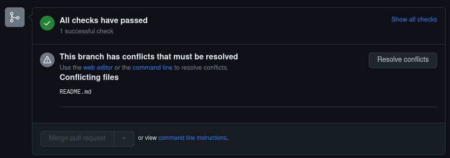

# 🧠 El merging

El merge es básicamente colapsar todos los commits de la nueva rama, dentro de un commit en la rama main.

<figure><figcaption></figcaption></figure>

Les va a suceder que tengan el mismo archivo, con las mismas lineas siendo ocupadas, y tendrán que tomar una decisión sobre qué línea quedarse, o al resolver el merge, tendrán que modificar el archivo resultante.

Cuando eso suceda, el merge no estará disponible.

<figure><figcaption>
Un ejemplo de un conflicto a resolver para fusionar ramas
</figcaption></figure>

Cuando le damos a resolver conflicto, tendremos esta situacion

<figure><figcaption></figcaption></figure>

Acá, lo que esto significa, es que estas líneas estan ocupando la misma porción de código, y hay que decidir qué versión quedarnos, si main-1 o main.\
Lo más fácil suele ser borrar todo y reescribir la versión que va a ir publicada. Dado que estamos en una situación complicada, es importante prestar atención.

<figure><figcaption></figcaption></figure>
