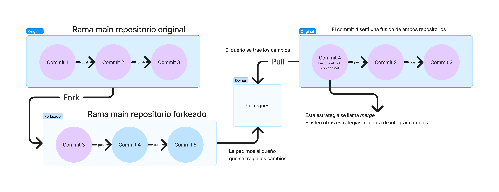

# 🤓 🤓☝️ Entendiendo el pull request

Genial, ahora tenemos nuestro repositorio remoto con los cambios que nosotros introducimos.&#x20;

Quizas el repositorio forkeado es un proyecto que nosotros queremos adaptar y quedarnoslo.&#x20;

Por el contrario, quizas nos interesa que nuestro trabajo sea integrado en el repositorio original, aquel que ha sido forkeado y que no nos pertenece.&#x20;

Para poder introducir cambios, nosotros le vamos a **proponer** al dueño de la **rama main** del **repositorio original**, que haga un **pull** d**e nuestra rama main**, haciendo una fusión de ramas, sincronizando ambos repositorios.

<figure><figcaption>
Abrir la imagen y leer con detenimiento
</figcaption></figure>
